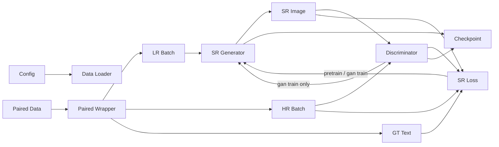
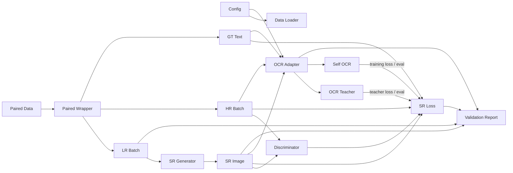

```mermaid
flowchart LR
    Cfg[Config]
    DL[Data Loader]
    PD[Paired Data]
    PW[Paired Wrapper]
    LR[LR Batch]
    HR[HR Batch]
    GT[GT Text]

    G[SR Generator]
    D[Discriminator]
    L[SR Loss]
    CKPT[Checkpoint]

    Cfg --> DL
    PD --> PW
    PW --> LR
    PW --> HR
    PW --> GT

    LR --> G
    G --> SR[SR Image]

    HR --> D
    SR --> D

    SR --> L
    HR --> L
    GT --> L
    D --> L

    L -->|pretrain / gan train| G
    D -->|gan train only| G
    G --> CKPT
    D --> CKPT
```

```mermaid
flowchart LR
    Cfg[Config]
    DL[Data Loader]
    PD[Paired Data]
    PW[Paired Wrapper]
    OCRA[OCR Adapter]
    OCRT[OCR Teacher]
    OCRM[Self OCR]

    LR[LR Batch]
    HR[HR Batch]
    GT[GT Text]

    G[SR Generator]
    D[Discriminator]
    L[SR Loss]
    VAL[Validation Report]

    Cfg --> DL
    Cfg --> OCRA
    PD --> PW
    PW --> LR
    PW --> HR
    PW --> GT

    LR --> G
    G --> SR[SR Image]

    HR --> D
    SR --> D

    SR --> L
    HR --> L
    GT --> L
    D --> L

    SR --> OCRA
    HR --> OCRA
    GT --> OCRA

    OCRA --> OCRT
    OCRA --> OCRM

    OCRT -->|teacher loss / eval| L
    OCRM -->|training loss / eval| L

    SR --> VAL
    LR --> VAL
    OCRA --> VAL
    L --> VAL
```

```mermaid
flowchart LR
    Cfg[Config]
    DL[Data Loader]
    PD[Paired Data]
    PW[Paired Wrapper]
    OCRA[OCR Adapter]
    OCRT[OCR Teacher]
    OCRM[Self OCR]

    LR[LR Batch]
    HR[HR Batch]
    GT[GT Text]

    G[SR Generator]
    D[Discriminator]
    L[SR Loss]
    VAL[Validation Report]

    Cfg --> DL
    Cfg --> OCRA
    PD --> PW
    PW --> LR
    PW --> HR
    PW --> GT

    LR --> G
    G --> SR[SR Image]

    HR --> D
    SR --> D

    SR --> L
    HR --> L
    GT --> L
    D --> L

    SR --> OCRA
    HR --> OCRA
    GT --> OCRA

    OCRA --> OCRT
    OCRA --> OCRM

    OCRT -->|teacher loss / eval| L
    OCRM -->|training loss / eval| L

    SR --> VAL
    LR --> VAL
    OCRA --> VAL
    L --> VAL
```
