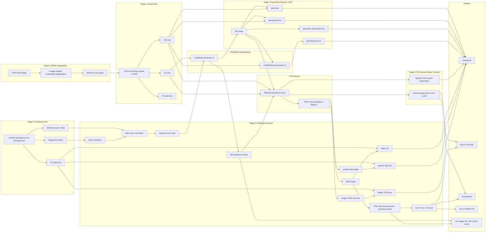

# Training Flow

## Stage 0

Stage 0 是離線資料生成，不進入 training loop。本階段以 UFPR 的 HR 影像為輸入，透過 nRCD 隨機多階段劣化產生 synthetic LR，並保留原本資料夾結構與 HR/metadata，只重建 `lr-*.png`。目的不是訓練模型，而是先做可控的資料擴充，讓 Stage 1 能在更接近真實監視器退化的 paired 條件下預訓練。

## Stage 1

Stage 1 使用 UFPR-SR-Plates 的 paired LR-HR 資料做基礎 SR 訓練。第一步是 generator pretrain，主要靠 pixel 與 perceptual loss 把重建能力學穩；第二步再加入 discriminator 進行 paired GAN training，提升紋理與視覺細節。這一階段的核心目標是得到穩定的 SR backbone，並維持可正常 checkpoint、resume、validation 的訓練流程。

## Stage 2

Stage 2 保留 Stage 1 的 paired SR 主體，另外接入 frozen PARSeq 作為 external OCR teacher / evaluator。這一階段不重訓 OCR backbone，而是利用 OCR prediction、confidence、score 來做 OCR-aware validation，並視設定加入保守的 OCR supervision，讓 SR 結果不只看重建，也更朝向可辨識文字優化。

## Stage 3

Stage 3 使用 XLPSR development set 的 sequence 資料做 challenge-specific finetune。流程包含讀取 sequence frame、依 detections.json 做 bbox crop、選幀後送進 generator 產生 SR，再接 frozen PARSeq backbone 與 trainable FRLP head。主要 supervision 改成 token、position type、length/EOS 等法國牌照任務導向 loss，並輸出 score、CSV 與可視化結果。

